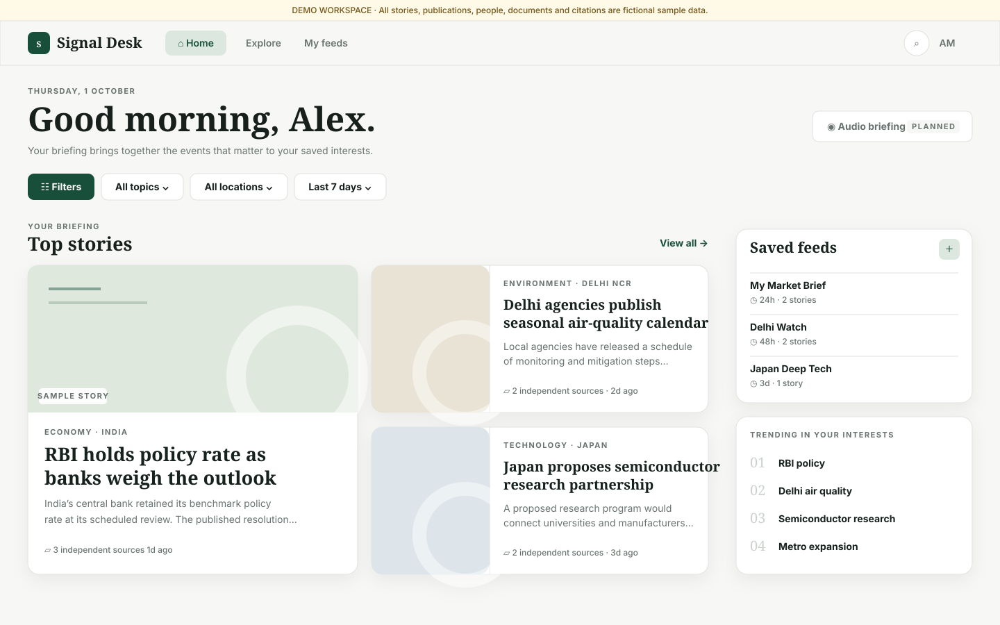

# Signal Desk

A production-oriented Phase 1 prototype for personalized, evidence-transparent news intelligence. Every visible story and publisher is explicitly fictional demo data.



## Run locally

```bash
cp .env.example .env.local
npm install
npm run dev
```

No credentials are needed while `NEWS_PROVIDER=mock`. Visit `http://localhost:3000`.

## Quality checks

```bash
npm run typecheck
npm run lint
npm run build
```

See [`docs/architecture.md`](docs/architecture.md) for boundaries, pipeline, integrations and security decisions. The proposed PostgreSQL schema is in [`supabase/migrations/0001_initial_schema.sql`](supabase/migrations/0001_initial_schema.sql); it is not required for the mock experience.

The current dependency and environment audit is recorded in [`docs/phase-1-verification.md`](docs/phase-1-verification.md), including the commands to rerun when registry access is available.
